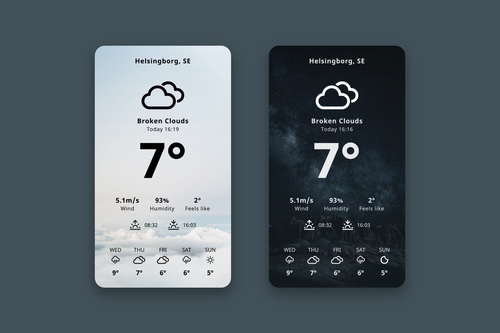

# Weather App

A Weather app that fetches weather forecast from OpenWeatherMap.org based on user's location.
Different theme depending on time of day (day / night). Different weather icons based on current weather.

## Built With

-   [Vue.js](https://vuejs.org/) - The web framework used
-   [OpenWeatherMap.org](https://openweathermap.org/api) - The API used

### Future developments

-   Search function
-   Update bakgrund image according to current weather
